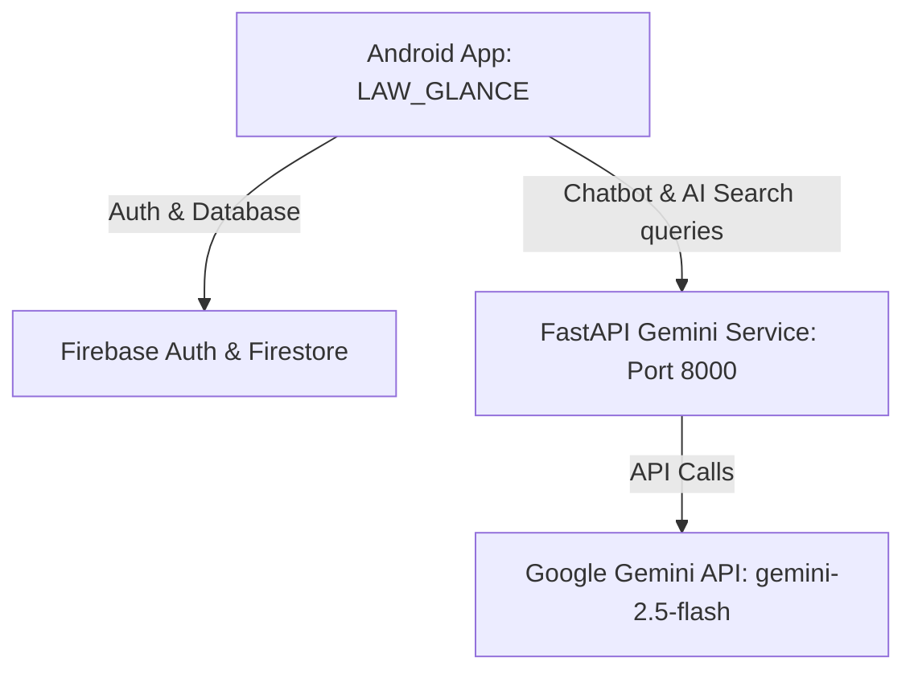

# LAW_GLANCE (Law Glance) - Legal Services & AI Platform

LAW_GLANCE is a modern, premium Android application designed to make legal resources, rights search, and consultation services accessible to everyone. The app integrates directly with Firebase Services for User Session Management and Database Records, and communicates with a Python FastAPI microservice that proxies prompt requests to Google's Gemini GenAI API.

---

## Architecture Overview

The project follows a **bypassed-backend, fully-serverless cloud architecture** utilizing Firebase Firestore and Authentication directly from the Android App, paired with a lightweight AI proxy.



1. **Android Application (`LAW_GLANCE`)**: Native Java-based client handling the user interface, session management, local databases, and routing logic.
2. **Firebase Integration**:
   * **Firebase Authentication**: Handles secure account creation, user logins, password resets, and email verification.
   * **Firebase Firestore**: A NoSQL cloud database storing user profiles, direct real-time chat histories, and global appointment bookings.
3. **Gemini Service (`gemini_service`)**: Python-based FastAPI microservice. Proxies AI queries directly to Google Gemini AI studio using the latest `google-genai` library.

---

## Role-Based Access Control (RBAC) System

The app implements a full-featured Role-Based Access Control (RBAC) system with three distinct user experiences:

### 1️⃣ CLIENT (User)
* **Onboarding**: Register with verification email flow, login, and forgot password triggers.
* **Offline Rights Search**: Instantly browse legal rights category-wise (IPC, Women, Cyber, Tenant, Traffic, Consumer, and others) offline from an embedded database asset (`assets/rights.json`).
* **AI Rights Helper**: Ask complex legal situations to Gemini to find matching IPC sections.
* **AI Chatbot**: Chat in real-time with an AI chatbot helper. Chat histories are saved and loaded directly from Firestore.
* **Appointment Booking**: Select a lawyer, pick a date/time, and request a booking.
* **Logout**: Signs out safely from FirebaseAuth.

### 2️⃣ LAWYER
* **Credentials Registration**: Register under the "Lawyer" role, which displays specialized inputs: *Specialization, Experience (Years), City, Consultation Fee, Bar Council Number, and About*.
* **Waiting Room**: Newly registered lawyers default to `approved: false` status and are routed to a pending approval screen. They cannot access the dashboard until an Administrator verifies their Bar credentials.
* **Lawyer CRM Dashboard**:
  * **CRM Stats Panel**: Displays live count cards for **Pending Requests, Today's Appointments,** and **Total History**.
  * **Pending Bookings**: Displays incoming client booking requests. Features functional **Accept** and **Reject** buttons to update status.
  * **Today's Schedule**: Displays accepted appointments scheduled for the current date.
  * **Appointment History**: Chronological feed of all past requests with color-coded status badges.
  * **Circular Initial Avatars**: Shows the initials of the client on every card.

### 3️⃣ ADMINISTRATOR (Admin)
* **Admin Dashboard**:
  * **System Statistics**: Displays live app counts for **Total Clients, Total Registered Lawyers,** and **Total System Bookings**.
  * **Dynamic Content Tabs**: Toggles content view dynamically:
    * **Lawyers Tab**: Lists all registered lawyers and displays an **Approve Profile** button next to pending registrations.
    * **Clients Tab**: Displays a directory of registered user profiles.
    * **Bookings Tab**: Lists all system appointments globally.

---

## Database Schemas (Firestore)

### `/Users/{uid}` (Document)
* Stores user account details and extra credentials.
```json
{
  "uid": "String",
  "name": "String",
  "email": "String",
  "role": "USER | LAWYER | ADMIN",
  "approved": "Boolean",
  "specialization": "String (Lawyers only)",
  "experience": "String (Lawyers only)",
  "city": "String (Lawyers only)",
  "fee": "String (Lawyers only)",
  "barCouncilNumber": "String (Lawyers only)",
  "about": "String (Lawyers only)"
}
```

### `/Users/{uid}/ChatHistory/{docId}` (Subcollection)
* Stores conversation histories for the AI Legal Chatbot.
```json
{
  "userMessage": "String",
  "botResponse": "String",
  "timestamp": "ServerTimestamp"
}
```

### `/Appointments/{docId}` (Collection)
* Stores system-wide booking requests.
```json
{
  "userId": "String (Client UID)",
  "userName": "String (Client Name)",
  "lawyerName": "String (Adv. Name)",
  "specialization": "String",
  "date": "String (d-M-yyyy)",
  "time": "String (HH:mm)",
  "status": "PENDING | ACCEPTED | REJECTED",
  "timestamp": "ServerTimestamp"
}
```

---

## How to Run the Project

### 1. Run the Python Gemini AI Service
1. Open PowerShell and navigate to `gemini_service`:
   ```powershell
   cd gemini_service
   ```
2. Activate the virtual environment:
   ```powershell
   ..\.venv\Scripts\Activate.ps1
   ```
3. Install dependencies:
   ```powershell
   pip install -r requirements.txt
   ```
4. Start the server:
   ```powershell
   python main.py
   ```
5. **Verify health:** Open browser and visit `http://localhost:8000/health`.

### 2. Configure Local Connection IP
Open [NetworkConfig.java](file:///c:/Users/Asus/OneDrive/Desktop/kuh_project/LAW_GLANCE/app/src/main/java/com/example/ywinked/NetworkConfig.java):
* **Emulator**: Set `BACKEND_IP = "10.0.2.2"`.
* **Physical Device**: Set `BACKEND_IP` to your computer's actual IPv4 address (e.g. `192.168.1.15`), and connect both devices to the same Wi-Fi network.

### 3. Build & Install Android App
Run these commands inside the `LAW_GLANCE` folder to build and run the app:
```powershell
cd LAW_GLANCE
.\gradlew installDebug
```
Alternatively, open `LAW_GLANCE` in Android Studio and click the green **Run** button.
